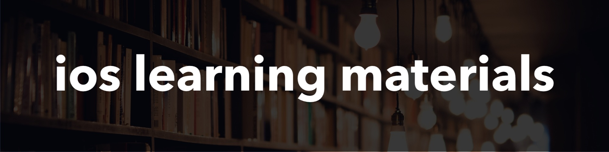

# ios-learning-materials 

### If you like the project, please give it a star ⭐ It will show the creator your appreciation and help others to discover the repo.

# ✍️ About

Curated list of articles, web-resources, tutorials, `Stack Overflow` and `Quora` Q&A, `GitHub`code repositories and useful resources that may help you dig a little bit deeper into iOS. All the resources are split into sub-categories which simlifies navigation and management. Feel free to use and suggest something to learn (iOS related of course 😜).

You may see some non-directly related topics such as `Computer Graphics`, `Machine Learning` or `Design Patterns` - these are actually related, in some ways, to `iOS` development, but in a much broader and more specific way. With the addition of new materials, the structure of the document will be properly maintained meaning that it will become a reference book for learning. Happy evolving 🤓:octocat:

# 📝 Content

- [About](#about)
- [Amazing Materials](Lists/AmazingMaterials.md)
- [SwiftUI](Lists/SwiftUI.md)
- [DocC](Lists/DocC.md)
- [ARKit](Lists/ARKit.md)
- [SceneKit](Lists/SceneKit.md)
- [SpriteKit](Lists/SpriteKit.md)
- [GameplayKit](Lists/GameplayKit.md)
- [ReplayKit](Lists/ReplayKit.md)
- [MapKit](Lists/MapKit.md)
- [UIKit](Lists/UIKit.md)
- [PhotoKit](Lists/PhotoKit.md)
- [HealthKit](Lists/HealthKit.md)
- [CloudKit](Lists/CloudKit.md)
- [TextKit](Lists/TextKit.md)
- [StoreKit](Lists/StoreKit.md)
- [SiriKit](Lists/SiriKit.md)
- [CallKit](Lists/CallKit.md)
- [PushKit](Lists/PushKit.md)
- [MetricKit](Lists/MetricKit.md)
- [CoreML](Lists/CoreML.md)
- [CreateML](Lists/CreateML.md)
- [Core Animation](Lists/CoreAnimation.md)
- [Core Graphics](Lists/CoreGraphics.md)
- [Core Image](Lists/CoreImage.md)
- [Core Location](Lists/CoreLocation.md)
- [Core Data](Lists/CoreData.md)
- [Core Motion](Lists/CoreMotion.md)
- [CoreNFC](Lists/CoreNFC.md)
- [Combine](Lists/Combine.md)
- [Metal](Lists/Metal.md)
- [Vision](Lists/Vision.md)
- [AVFoundation](Lists/AVFoundation.md)
- [AppKit](Lists/AppKit.md)
- [SearchKit](Lists/SearchKit.md)
- [Auto Layout](Lists/AutoLayout.md)
- [AuthenticationServices](Lists/AuthenticationServices.md)
- [Project Catalyst](Lists/ProjectCatalyst.md)
- [Asset Catalog](Lists/AssetCatalog.md)
- [Playgrounds](Lists/Playgrounds.md)
- [In-App Purchase](Lists/InAppPurchase.md)
- [Auto Fill](Lists/AutoFill.md)
- [NLP](Lists/NLP.md)
- [Foundation](Lists/Foundation.md)
- [Swift](Lists/Swift.md)
- [Swift Package Manager](Lists/SwiftPackageManager.md)
- [Xcode](Lists/Xcode.md)
- [Persistence](Lists/Persistence.md)
- [Internationalization & Localization](Lists/InternationalizationAndLocalization.md)
- [Security](Lists/Security.md)
- [Payments](Lists/Payments.md)
- [Document Based Apps](Lists/DocumentBasedApps.md)
- [Networking](Lists/Networking.md)
- [Frameworks Development](Lists/FrameworksDevelopment.md)
- [Debugging](Lists/Debugging.md)
- [Testing](Lists/Testing.md)
- [App Submission](Lists/AppSubmission.md)
- [App Extensions](Lists/AppExtensions.md)
- [WWDC](Lists/WWDC.md)
- [Git](Lists/Git.md)
- [Development](Lists/Development.md)
- [Algorithms and Data Structures](Lists/AlgorithmsAndDataStructures.md)
- [Asynchronous Programming](Lists/AsynchronousProgramming.md)
- [Functional Programming](Lists/FunctionalProgramming.md)
- [Protocol-Oriented Programming](Lists/ProtocolOrientedProgramming.md)
- [Architecture And Design Patterns](Lists/ArchitectureAndDesignPatterns.md)
- [Test Driven Development](Lists/TestDrivenDevelopment.md)
- [Clean Code](Lists/CleanCode.md)
- [Continuous Integration (CI)](Lists/ContinuousIntegration.md)
- [Computer Graphics](Lists/ComputerGraphics.md)
- [Machine Learning](Lists/MachineLearning.md)
- [App Distribution](Lists/AppDistribution.md)
- [Dependency Management](Lists/DependencyManagement.md)
- [Physics Engines](Lists/PhysicsEngines.md)
- [Frameworks, Libraries, Platforms](Lists/FrameworksLibrariesPlatforms.md)
- [SwiftSyntax](Lists/SwiftSyntax.md)
- [Design](Lists/Design.md)
- [UX](Lists/UX.md)
- [Accessibility](Lists/Accessibility.md)
- [Interview](Lists/Interview.md)
- [Business](Lists/Business.md)
- [Project Management](Lists/ProjectManagement.md)
- [Product](Lists/Product.md)

# ⚠️ Disclamer
**Please** note that some materials may not provide ***the best possible or the most optimal*** recommendations, solutions or source codes. Try to be open minded and take everything as a `step` in the `learning process`. If you encounter something to improve in the materials, **please** write your suggestions to the respected authors. 

# 🤩 Stargazers

# 👨‍💻 Author
[Astemir Eleev](https://github.com/jVirus)

# 🔖 Licence
The project is availabe under [MIT Licence](https://github.com/jVirus/ios-learning-materials/blob/master/LICENSE)
